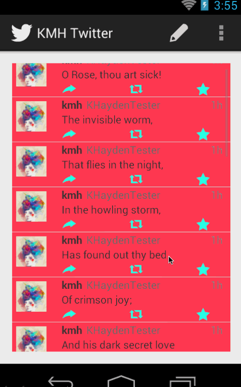
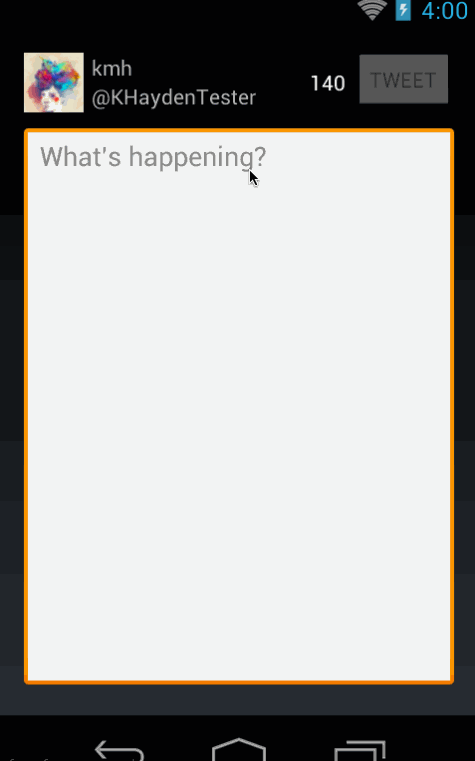

# SimpleTwitterClient

This is the second assignment for the Android CodePath class.

Time spent: 17h

* Video walkthrough plus debugging:
..* 5 hours
..* Wednesday, 18th
..* 22:30 - 3:20
* Starting on other required
..* 3 hours
..* Thursday, 19
..* 23:00 - 2? although slowed towards the end

Completed required user stories:

* [x] User can sign in to Twitter using OAuth login
* [x] User can view the tweets from their home timeline
..* [x] User should be able to see the username, name, body and timestamp for each tweet
..* [x] User should be displayed the relative timestamp for a tweet "8m", "7h"
..* [x] User can view more tweets as they scroll with infinite pagination
..* [x] Optional: Links in tweets are clickable and will launch the web browser (see autolink)
* [x] User can compose a new tweet
..* [x] User can click a “Compose” icon in the Action Bar on the top right
..* [x] User can then enter a new tweet and post this to twitter
..* [x] User is taken back to home timeline with new tweet visible in timeline
..* [x] Optional: User can see a counter with total number of characters left for tweet
..* [x] Extra: Character count color changes to yellow with <10
characters left to use, to red with no chars left to use
..* [x] Extra: Tweet button is disabled on too many or few charaters.

Walkthrough of all user stories:

GIF created with [LiceCap](http://www.cockos.com/licecap/).
