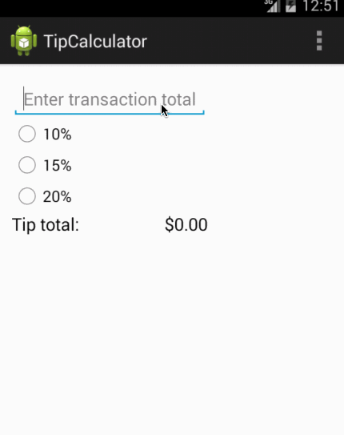

# TipCalculator

This is the first assignment for the Android CodePath class.

Time spent: 3 hours in total for required elements. Currently working
on optional elements.

Completed user stories:

 * [x] User is displayed the tip of specified percentage for specified entered amount
 * [x] User enters the total amount of the transaction
 * [x] User can select between tip amounts (i.e 10%, 15%, 20%)
 * [x] Upon selecting tip amount, formatted tip value is displayed

Notes:

Spent some time getting set up with Android Studio.

Walkthrough of all user stories:

GIF created with [LiceCap](http://www.cockos.com/licecap/).
